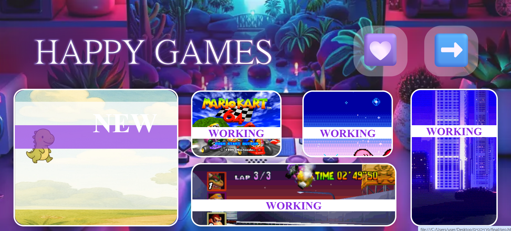
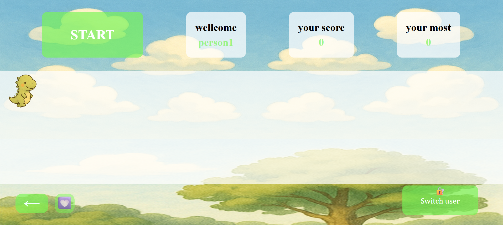
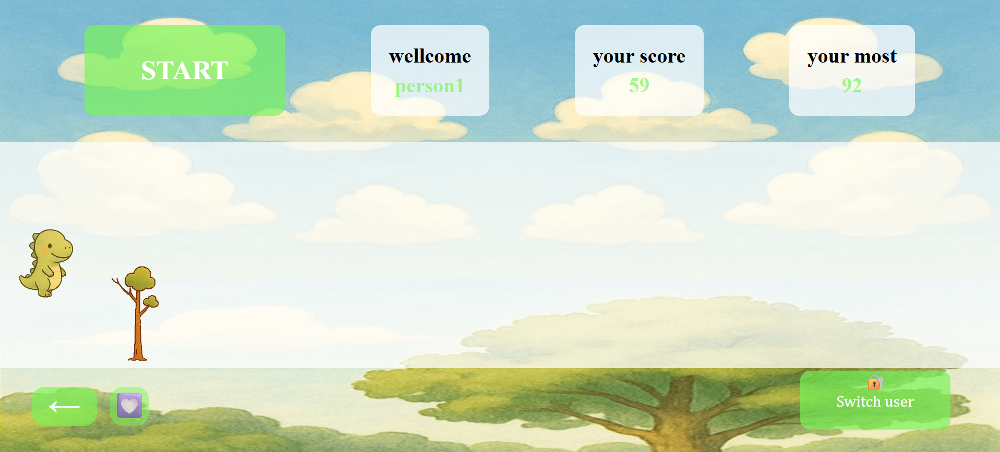
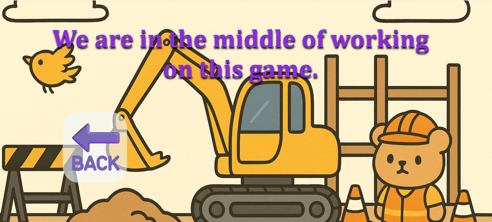

## 🦖 Project Description – The Jumping Dinosaur Game

This project is a simple and fun browser game where a small dinosaur jumps over obstacles.
The player's goal is to avoid collisions by jumping at the right time and score as many points as possible as the game progresses and the speed increases.

The game includes:

* **Basic gameplay mechanics** – a single key press to jump.
* **Fast responsiveness** – the dinosaur reacts immediately to the player's input.
* **Smart scoring** – the highest score is saved and used as a High Score for future games.
* **Login page** – allows structured and convenient access to the site before starting the game.

Additionally, the website is **under development**, and more games are planned to be added in the future to provide a more diverse gaming experience.

The project demonstrates effective use of **HTML, CSS, and JavaScript** to create a lightweight, engaging, and user-friendly gaming experience.

---

